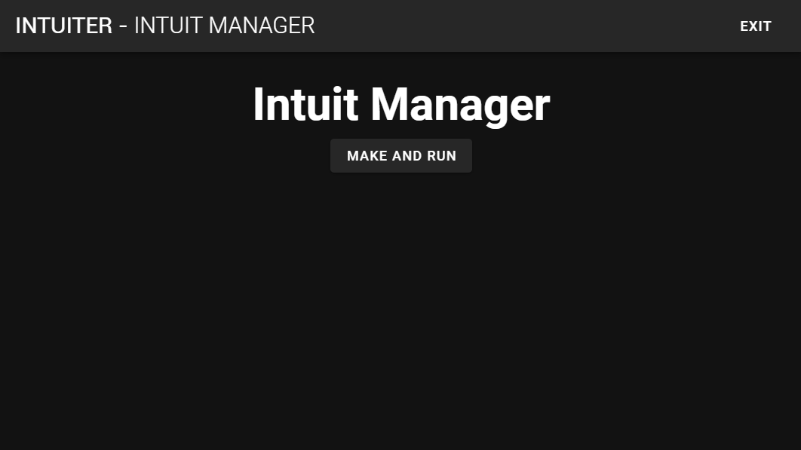

[](https://electronjs.org/)
[](https://standardjs.com)
[](https://github.com/sungle3737/intuiter/blob/master/vue.config.js)
[](https://github.com/sungle3737/intuiter/tree/master/resources/ahk)
[](https://github.com/ellerbrock/open-source-badges/)
[](https://github.com/sungle3737/intuiter/blob/master/LICENSE)

<br/>

# intuiter
### Windows global version Vim Substitute and more++
Vim and Emacs are too hard and not intuitive in my opinion.
So I developed new key map which can be used by not only for developer but also normal user.

Vim 과 Emacs 모두 단축키가 해당 툴의 생산성의 핵심이라고 생각하는데, hjkl로 이동하는 vim은 직관적인 부분이 부족하고,  emacs는 어느 프로그램에서나 쓰기에는 단축키의 대부분이 프로그램과 겹치며 요즘 개발 메타에는 자주 쓰이지 않는 키들이 많습니다

둘다 마음에 차지 않는 부분이 있었고, 개발자 뿐만 아니라 일반 사용자도 높은 생산성과 접근성을 가질 수 있도록 설계했습니다

If you **Use** computer, this program will definitely help you.

<br/>

# How to Install
Intuiter is provided by Windows Official package manager `winget`
press `win + x` and `a` ant type

```bash
winget install intuiter
```

winget 이 있다면 바로 위 커맨드를 통해 설치가 가능하고 winget 이 없다면 스토어에서 다운 후 설치가 
if you don't have `winget` [press here](https://www.microsoft.com/ko-kr/p/app-installer/9nblggh4nns1?ocid=9nblggh4nns1_ORSEARCH_Bing&rtc=2&activetab=pivot:overviewtab)

- Windows Store distribution is planned
- You can also download from release tab - but smart screen problem will happen

<br/>

# How to Use


### Just Press **Make and Run** Button


If System Icon Appear like this, the program is running

### Intuiter use **wasd movement** concept in gaming to **text** and **screen** like vim but more better and wider


If you write a lot by pc, this program will be fit for you

## Best Features (not all)

- `alt` + `ikjl` - power arrow
- `win` + `ikjl` - mouse control with **accelleration**
- `alt` + `esdf` - normal arrow
- `alt` + `bi` - backspace, delete
- `alt` + `uo` - mouse scroll with **acceleration**
- `alt` + `yp` - tab control
- `alt` + `a` - select line
- `alt` + `w` - select word

<br/>

- `ctrl` means `power`
- `shift` means `speed`

### Try press ctrl or shift while using upper shortcuts

1. Do Power Delete


2. Move Text Cursor very fast or Jump


3. Scroll without mouse


4. select text by shortcut


5. Click without mouse


<br/>

# VSCode light version
- [terminal intuiter](https://marketplace.visualstudio.com/items?itemName=seonglae.terminal-intuiter) - VSCode Productivity Tool

<br/>

# Warning
This Program coulb be considered as game hack

<br/>

# Info
## How I Developed

- `Electron` - Engine
- `Vue, Vuetify` - Front
- `AutoHotkey` - Core
- `Github Action` - Distribution

## How to Use

- Use free
- Please report issue by github or below link comment
- below link contains precise usage

- [Documentation](https://images.pexels.com/photos/2755173/pexels-photo-2755173.jpeg?cs=srgb&dl=wasd-2755173.jpg)

# How to Contribute

This Project is only for windows but another project [robota]() is developing
which support mac os, and linux but this will be maintained

- ahk user can contribute to core
- js user can contribute electron, vue
- this is my first big project, code is not clean

# To do List

- ahk extension
- custom keybinding feature
