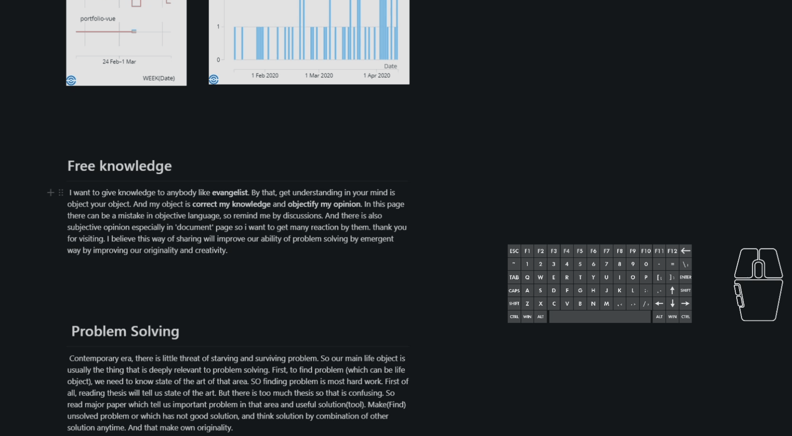
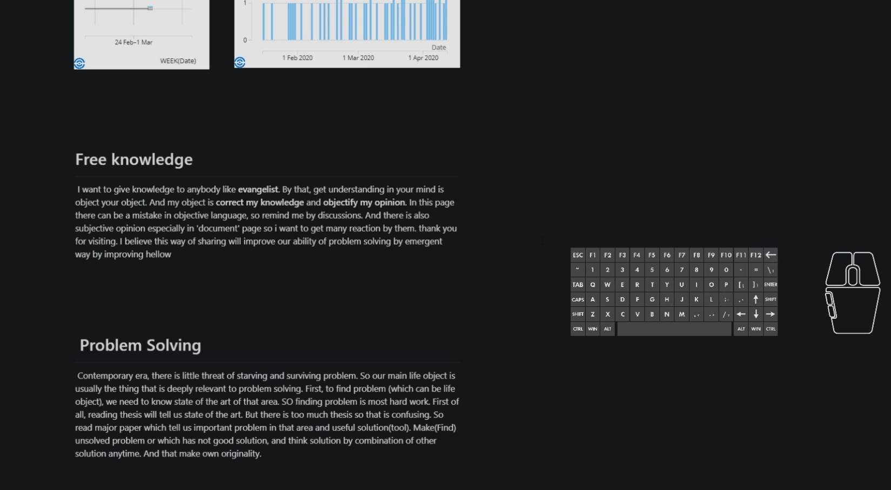
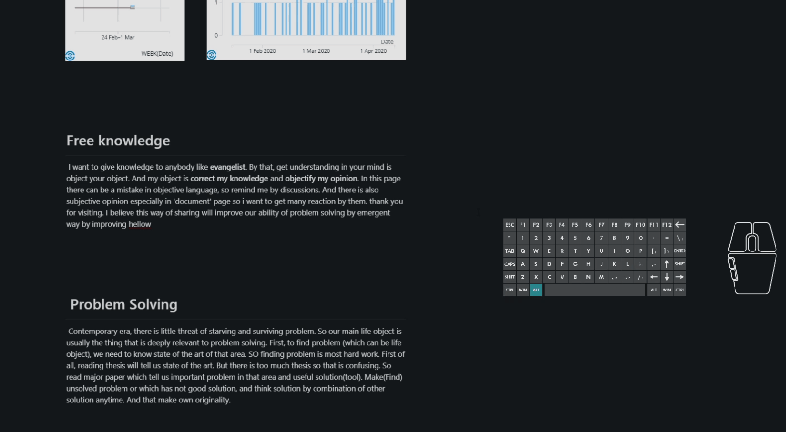
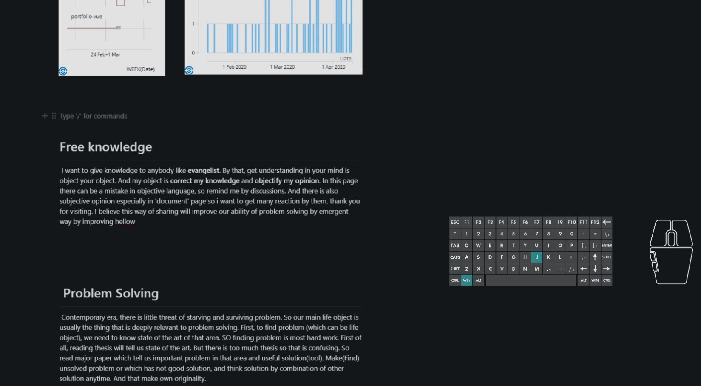

[](https://electronjs.org/)
[](https://standardjs.com)
[](https://github.com/sungle3737/intuiter/blob/master/vue.config.js)
[](https://github.com/sungle3737/intuiter/tree/master/resources/ahk)
[](https://github.com/ellerbrock/open-source-badges/)
[](https://github.com/sungle3737/intuiter/blob/master/LICENSE)

# intuiter

### Windows global Vim Substitute ++

# How to Install

```bash
winget install intuiter
```

# How to Use

### Intuiter use `wasd movement` concept in gaming to `text` and `screen` like vim but more better and wider


If you write a lot by pc, this program will be fit for you

## Best Features (not all)

- `alt` + `ikjl` - power arrow
- `win` + `ikjl` - mouse
- `alt` + `esdf` - normal arrow
- `alt` + `bi` - backspace, delete

- `ctrl` means `power`
- `shift` means `speed`

### 1. Do Power Delete



### 2. Move Text Cursor very fast or Jump



### 3. Scroll without mouse


### 4. select text by shortcut



### 5. Click without mouse



# How I Developed

- `Electron` - Engine
- `Vue, Vuetify` - Front
- `AutoHotkey` - Core
- `Github Action` - Distribution

# How to Use

- Use free
- Please report issue by github or below link comment
- below link contains precise usage

- [Documentation](https://images.pexels.com/photos/2755173/pexels-photo-2755173.jpeg?cs=srgb&dl=wasd-2755173.jpg)

# How to Contribute

This Project is only for windows but another project [robota]() is developing
which support mac os, and linux but this will be maintained

- ahk user can contribute to core
- js user can contribute electron, vue
- this is my first big project, code is not clean

# To do List

- ahk extension
- custom keybinding feature
